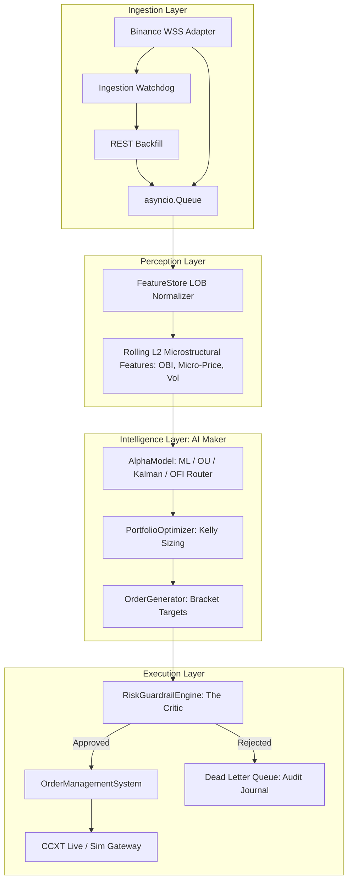

# Enterprise Cryptocurrency Medium-Frequency Trading (MFT) System

This repository contains a highly modular, production-grade Medium-Frequency Trading (MFT) system engineered for cryptocurrency markets (Binance). The architecture is built around **Zero-Tolerance Fault Isolation**, strictly separating ingestion from mathematics, intelligence from execution, and enforcing Maker-Critic risk guardrails.

---

## 🏗️ Architectural Overview



---

## 📂 Directory Structure

```text
mft_project/
├── core/
│   ├── schemas.py             # Unified contracts (InternalTick, Binance payloads)
│   └── exceptions.py          # Domain exception hierarchy (DataStall, RateLimit)
├── ingestion/
│   ├── base_adapter.py        # Abstract interface contract (DataFeedAdapter)
│   ├── watchdog.py            # Health monitoring & REST reconciliation
│   └── binance_adapter.py     # Binance Crypto WSS adapter
├── perception/
│   └── feature_store.py       # Rolling L2 microstructural features (OBI, Micro-price)
├── intelligence/
│   ├── alpha_engine.py        # Alpha predictions routing, Kelly sizing, & Bracket Generation
│   ├── strategy_factory.py    # Strategy Factory registry pattern
│   ├── base_strategy.py       # Standardized strategy interface contract
│   ├── ou_alpha.py            # Ornstein-Uhlenbeck Mean-Reversion strategy
│   ├── kalman_alpha.py        # State-Space Kalman Filter strategy
│   ├── ofi_alpha.py           # Order Flow Imbalance strategy
│   ├── ml_alpha.py            # Tabular LightGBM ML strategy
│   ├── heuristic_alpha.py     # Statistical rule-based fallback strategy
│   ├── directional_alpha.py   # Directional Bias strategy (Micro-price drift)
│   ├── portfolio_optimizer.py # Kelly sizing portfolio allocator
│   └── order_generator.py     # Bracket entry targets generator
├── execution/
│   ├── risk_guardrails.py     # Risk Critic zero-tolerance guardrails
│   ├── dead_letter_queue.py   # Audit journal for rejected orders
│   ├── oms.py                 # Order Management System state machine
│   └── execution_gateway.py   # CCXT live/simulation execution gateway
├── backtester/
│   └── engine.py              # High-fidelity historical Tick-by-Tick Bracket Simulator
├── dlq_audit.json             # Dead Letter Queue audit log for rejected orders
├── trade_journal.json         # Realized execution metrics logger (Buy/Sell, P&L, Slippage)
├── requirements.txt           # Dependency requirements
├── run_backtest.py            # Synthetic tick series runner (default strategy)
├── run_competition.py         # Side-by-side mathematical alpha league table harness
├── run_directional_strategy.py# Standalone profit-only directional strategy runner
└── main.py                    # Asyncio orchestration entry point
```

---

## 🚀 Installation & Setup

1. **Create a Python Virtual Environment:**
   ```bash
   python3 -m venv venv
   source venv/bin/activate
   ```

2. **Install Dependencies:**
   ```bash
   pip install -r requirements.txt
   ```

---

## ⚙️ Configuration & Environment Variables

The system uses environment variables to control execution modes, active models, and safety limits.

| Variable | Description | Default | Options |
| :--- | :--- | :--- | :--- |
| `PAPER_TRADING` | `true` for simulation, `false` for live money execution | `true` | `true`, `false` |
| `ALPHA_MODEL_TYPE` | Active prediction model class | `KALMAN` | `KALMAN`, `OU`, `OFI`, `ML`, `HEURISTIC` |
| `PORTFOLIO_CASH_VALUE` | Starting bankroll in USD | `10000.0` | Any positive float |
| `BINANCE_API_KEY` | Your live Binance API Key (Required for live trading) | `None` | Your API Key |
| `BINANCE_API_SECRET` | Your live Binance API Secret (Required for live trading) | `None` | Your API Secret |

---

## 🧪 Dynamic Alpha Models: How to Choose

The intelligence core supports dynamic switching between a production LightGBM ML model and three classic low-latency mathematical engines:

* **`KALMAN`**: Estimates a clean "fair price" state space, trading convergence gaps between mid-market price and volume-weighted micro-prices.
* **`OU` (Ornstein-Uhlenbeck)**: Models continuous-time stochastic mean reversion vectors.
* **`OFI` (Order Flow Imbalance)**: Tracks continuous tick changes in top-of-book depth bids and asks to trade momentum.
* **`ML`**: Uses LightGBM decision trees (requires `weights.lgb` in system root).
* **`HEURISTIC`**: Default statistical rule-based mean reversion fallback.

---

## 🎮 Running Backtests & Mathematical Competitions

Before running live, you can simulate the performance of all models to find the optimal predictor:

### 1. Run a Single Backtest:
Runs a fast, tick-by-tick simulation on the default backtest configuration.
```bash
python3 run_backtest.py
```

### 2. Run the Model Competition Harness:
Simulates **five mathematical engines** (OU, KALMAN, OFI, HEURISTIC, and DIRECTIONAL) side-by-side over a 15,000-tick series (quiet ranges and violent trends) and prints a competitive league table.
```bash
python3 run_competition.py
```

### 3. Run the Directional Strategy:
Runs a standalone backtest for the Micro-price drift Directional strategy with profit-only exit parameters (0.5% TP, disabled SL).
```bash
python3 run_directional_strategy.py
```

---

## 📊 Auditing Trade Execution: `trade_journal.json`

Every live or paper trade (entry and exit) is logged with high-fidelity transaction metadata to `/usr/local/google/home/singhujwal/mft_project/trade_journal.json` in structured JSON format:

* **ENTRY Log Sample:**
  ```json
  {"timestamp": 1779089845, "symbol": "BTCUSDT", "action": "ENTRY_BUY", "reason": "STRATEGY_SIGNAL", "entry_price": 65006.50, "exit_price": 0.0, "trade_pnl": 0.0, "cumulative_pnl": 0.0, "portfolio_value": 9999.60, "fee_paid": 0.4000}
  ```

* **EXIT Log Sample (Take-Profit Triggered):**
  ```json
  {"timestamp": 1779091645, "symbol": "BTCUSDT", "action": "EXIT_BUY", "reason": "TAKE_PROFIT", "entry_price": 65006.50, "exit_price": 65526.55, "trade_pnl": 160.00, "cumulative_pnl": 160.00, "portfolio_value": 10158.80, "fee_paid": 0.8000}
  ```

---

## ⚠️ Running Live Production Mode (Real Money)

Live Production mode initializes a real `ccxt.pro` client. **It will execute real limit orders on Binance using your actual account balance.**

```bash
export BINANCE_API_KEY="your_live_api_key"
export BINANCE_API_SECRET="your_live_api_secret"
export PORTFOLIO_CASH_VALUE="5000.0"
export PAPER_TRADING="false"
export ALPHA_MODEL_TYPE="KALMAN"

python3 main.py
```

---

## 🛡️ Fault Isolation & Recovery Mechanics

1. **WebSocket Disconnection:** If your cloud instance experiences network jitter, the `IngestionWatchdog` automatically reconnects and queries Binance's REST depth endpoint (`aiohttp`) to backfill missing ticks.
2. **Schema Validation:** Built with `Pydantic`. Malformed exchange JSON frames are caught and logged without crashing the async event loop.
3. **Bracket Auto-Sell:** Bracket positions include a **Time-out Exit** (30 minutes). If a trade does not touch Take-Profit or Stop-Loss boundaries, the bot flattens it automatically via a Market Taker order to eliminate overnight volatility exposure.
4. **Emergency Liquidation:** If `main.py` crashes, encounters an unhandled system error, or is terminated via `Ctrl+C`, the system triggers an instant fail-safe checkout, executing a market-sell to flatten all open positions to USD immediately.
