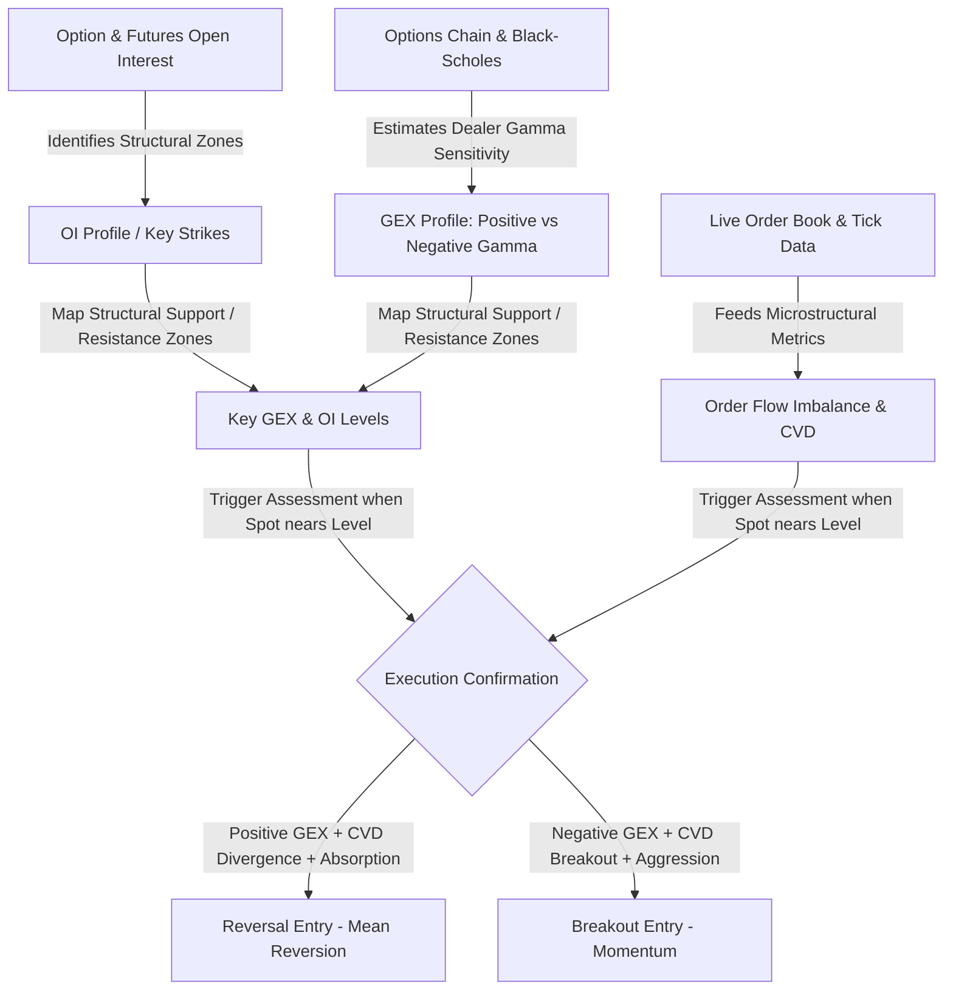
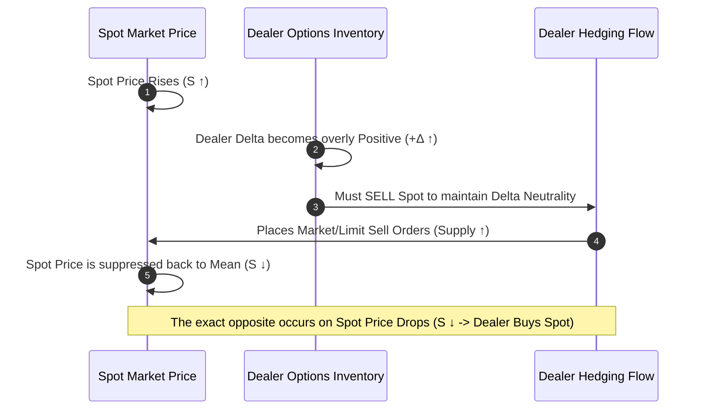
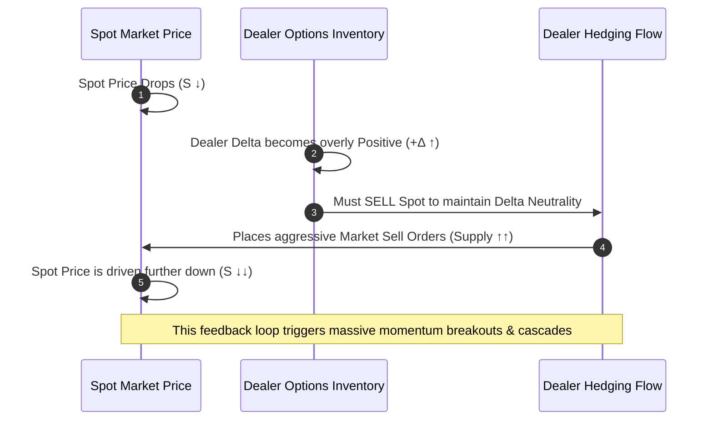

# 📊 The GEX-OI-OrderFlow Unified Quantitative Framework
## Linking Dealer Hedging Pressure with Microsecond Market Microstructure

This document outlines the theoretical foundation, mathematical formulations, and systematic trade execution mechanics of the **Gamma Exposure (GEX)**, **Open Interest (OI)**, and **Order Flow** unified trading framework. 

By combining macro-structural positioning (OI) with dealer hedging dynamics (GEX) and microsecond execution confirmation (Order Flow), we bridge the gap between option-theoretical price gravity and live market microstructure.

---

## 🗺️ Conceptual Architecture Overview

In high-frequency and medium-frequency quantitative trading, traditional indicators (e.g., RSI, MACD) fail because they are lagging heuristics of price. This framework, however, relies on **structural flows** that *must* occur due to contract design, market making constraints, and order book mechanics.



---

## 1. 📐 Component Deep-Dive

### A. Open Interest (OI): The Map of Capital Allocation
Open Interest represents the total number of outstanding derivative contracts that have not yet been settled or closed. 
*   **Why it matters:** High Open Interest at a specific strike price represents a heavy concentration of capital. Since these positions are held by institutions, retail, and market makers, they act as **structural magnets** and **defense lines**.
*   **Call vs. Put OI Profiles:**
    *   **Call OI Spikes:** Act as strong overhead resistance. Traders sell calls to collect premium, while buyers buy them. If a strike has extreme Call OI, the underlying asset often struggles to breach it unless driven by massive spot buying.
    *   **Put OI Spikes:** Act as strong downside support. Traders use puts for protection or premium generation. High put OI strikes represent levels where market participants are willing to step in.

### B. Gamma Exposure (GEX): Dealer Hedging Dynamics
Gamma Exposure (GEX) measures the dollar-value sensitivity of options delta to changes in the spot price of the underlying asset. It is a proxy for **market maker (dealer) hedging constraints**.

Dealers are the liquidity providers of the options market. When a trader buys a call or a put, the dealer takes the opposite side:
1.  **Dealer Sells Call:** Dealer is negative delta ($-\Delta$). To remain neutral, they must **buy** the underlying asset:
    $$\text{Hedge Position} = +\Delta \times S$$
2.  **Dealer Sells Put:** Dealer is positive delta ($+\Delta$). To remain neutral, they must **sell / short** the underlying asset:
    $$\text{Hedge Position} = -\Delta \times S$$

As the spot price ($S$) moves, the dealer’s delta changes. They must continuously adjust their spot hedge. This adjustment speed is governed by **Gamma ($\Gamma$)**:

$$\Gamma = \frac{\partial \Delta}{\partial S} = \frac{\partial^2 V}{\partial S^2}$$

#### The Positive vs. Negative GEX Regimes:

| Regime | Market Maker Positioning | Dealer Hedging Rule | Impact on Volatility | Market Behavior |
| :--- | :--- | :--- | :--- | :--- |
| **Positive GEX** | Net Long Option Premium (Retail Net Short Options) | **Buy Low, Sell High** (Counter-Trend) | **Volatility Dampener** (Pinning / Volatility Crushes) | Spot price is drawn to the GEX strike like a magnet and gets "pinned" there. |
| **Negative GEX** | Net Short Option Premium (Retail Net Long Options) | **Buy High, Sell Low** (Pro-Trend) | **Volatility Accelerator** (Squeezes / Liquidation Runs) | Spot price breakouts are amplified; rapid runs and cascades occur once levels crack. |

#### The Mathematics of GEX Estimation:
For a given strike ($K$), the dealer's net Gamma Exposure (in contracts or cash) is calculated as:

$$GEX_{K} = \left( OI_{Call, K} \times \Gamma_{Call, K} - OI_{Put, K} \times \Gamma_{Put, K} \right) \times S^2$$

Where:
*   $OI_{Call, K}, OI_{Put, K}$ are the open interest contract counts at strike $K$.
*   $\Gamma_{Call, K}, \Gamma_{Put, K}$ are the Black-Scholes Option Gammas at strike $K$.
*   $S$ is the spot price of the underlying.

### C. Order Flow: Live Microstructural Execution
While OI and GEX map out the battleground, **Order Flow** shows the actual real-time combat. It provides execution confirmation using microstructural metrics:

1.  **Order Flow Imbalance (OFI):** Measures net changes in limit order depth at the best bid and ask:
    $$OFI_t = \Delta \text{BidQty}_t - \Delta \text{AskQty}_t$$
    *   A positive OFI shows strong buying pressure accumulating at the inside bid.
    *   A negative OFI shows strong selling pressure accumulating at the inside ask.
2.  **Cumulative Volume Delta (CVD):** The rolling sum of aggressive market order volume difference:
    $$CVD_T = \sum_{t=1}^{T} \left( \text{Aggressive Buy Volume}_t - \text{Aggressive Sell Volume}_t \right)$$
3.  **Passive Volume Absorption:** Occurs when aggressive buying (high CVD) or aggressive selling (low CVD) hits a level, but the price **fails to advance**. This indicates that a passive market participant (often a hedging dealer or institutional block order) is swallowing up the aggressive flow.

---

## 🔄 2. The Dealer Hedging Feedback Loops

Understanding how dealers re-hedge options is critical. Below are visual representations of the two fundamental dealer feedback loops.

### Positive Gamma Regime (Volatility Dampener)
In a positive GEX environment, dealers' hedging flows act as a stabilizing brake on price moves.



### Negative Gamma Regime (Volatility Accelerator)
In a negative GEX environment, dealers' hedging flows act as fuel to price moves, creating short squeezes or flash crashes.



---

## 🛠️ 3. Tactical Playbook & Trade Setup Matrix

By synthesizing GEX, OI, and Order Flow, we formulate two distinct quantitative setups:

```
                [Spot Price Approaching Major GEX / OI Level]
                                     |
                  +------------------+------------------+
                  |                                     |
           [Positive GEX Zone]                   [Negative GEX Zone]
                  |                                     |
        (Volatility Dampening)                 (Volatility Acceleration)
                  |                                     |
        [Look for Reversal]                    [Look for Breakout]
                  |                                     |
   - CVD Divergence                       - CVD breakout matches Spot
   - High Volume + Bid/Ask Absorption     - Strong Order Flow Imbalance
   - Aggressor Exhaustion                 - High Aggression Ratio
                  |                                     |
        ==> ENTRY: Reversal                    ==> ENTRY: Momentum Breakout
```

### Strategy Matrix Table

| Setup | Core GEX State | Level Type | Microstructural Confirmation | Actionable Trade |
| :--- | :--- | :--- | :--- | :--- |
| **The GEX Wall Reversal** | High Positive GEX | Major Call/Put Wall ($OI_{Max}$) | **Absorption:** Extremely high volume traded on Bid/Ask with flatlining price. CVD diverges (e.g., CVD makes new highs, but Spot price cannot breach the Ask). | **Short (at Call Wall)** or **Long (at Put Wall)** with tight stops just outside the wall. |
| **The Gamma Breakout (Squeeze)** | Negative GEX | Level Cracks / Liquidation Zone | **Acceleration:** High Aggression Ratio ($>2.5$), sharp jump in CVD matching the spot move, sudden decline in bid-ask depth (liquidity vacuum). | **Long Breakout (above Call Wall)** or **Short Breakout (below Put Wall)** chasing the momentum. |

---

## 💻 4. Mathematical Code Representation

Below is a conceptual implementation of this quantitative strategy designed to match the **Strategy Factory Design Pattern** in your trading system.

This class, `GEXAlphaStrategy`, extends your existing `BaseAlphaStrategy` contract:

```python
import numpy as np
from abc import ABC, abstractmethod
import scipy.stats as stats
from intelligence.base_strategy import BaseAlphaStrategy

class GEXAlphaStrategy(BaseAlphaStrategy):
    """
    Advanced Quantitative Alpha Strategy utilizing option Gamma Exposure (GEX),
    Open Interest (OI), and Microstructural Order Flow Imbalance (OFI).
    """
    def __init__(self, 
                 expiry_days: float = 7.0, 
                 risk_free_rate: float = 0.05,
                 gex_threshold: float = 1.5,       # Z-score threshold for key walls
                 ofi_threshold: float = 2.0):      # Threshold for Order Flow confirmation
        self.t = expiry_days / 365.0               # Time to expiry scaled
        self.r = risk_free_rate
        self.gex_threshold = gex_threshold
        self.ofi_threshold = ofi_threshold
        
        # Mock strike chain mapping for demonstration (Strike -> [Call OI, Put OI, Volatility])
        # In production, this is updated dynamically via a derivatives exchange adapter (e.g., Deribit)
        self.options_chain = {} 

    def _calculate_black_scholes_gamma(self, S: float, K: float, sigma: float) -> float:
        """Calculates the Black-Scholes Gamma (d^2 V / dS^2) of an option."""
        if S <= 0 or K <= 0 or sigma <= 0 or self.t <= 0:
            return 0.0
        d1 = (np.log(S / K) + (self.r + 0.5 * sigma**2) * self.t) / (sigma * np.sqrt(self.t))
        gamma = stats.norm.pdf(d1) / (S * sigma * np.sqrt(self.t))
        return gamma

    def calculate_gex_profile(self, spot_price: float) -> dict:
        """
        Computes the absolute dealer GEX for each active strike level.
        GEX = (Call_OI * Call_Gamma - Put_OI * Put_Gamma) * S^2
        """
        gex_profile = {}
        for strike, (call_oi, put_oi, sigma) in self.options_chain.items():
            # Gamma is mathematically identical for European calls and puts at the same strike
            gamma = self._calculate_black_scholes_gamma(spot_price, strike, sigma)
            
            # Calculate net cash GEX (scaled to millions of dollars for readability)
            net_gex = (call_oi * gamma - put_oi * gamma) * (spot_price ** 2) * 0.01
            gex_profile[strike] = net_gex
        return gex_profile

    def predict(self, features: np.ndarray) -> float:
        """
        Unified prediction pipeline executing GEX, OI, and Order Flow confirmation.
        
        Args:
            features: 6-dimension float array computed by FeatureStore containing:
                      [z_score, spread_z_score, rolling_imbalance, micro_price_drift, rolling_vol, mid_price]
        """
        # 1. Unpack standard features
        z_score = features[0]
        spread_z_score = features[1]
        rolling_imbalance = features[2]     # Proxy for Order Flow Imbalance (OFI)
        micro_price_drift = features[3]
        rolling_vol = features[4]
        mid_price = features[5]

        # Ensure options chain is populated for computation
        if not self.options_chain:
            # Standard fallback to microstructural imbalance if no derivatives data is present
            return np.clip(rolling_imbalance * 0.1, -1.0, 1.0)

        # 2. Calculate GEX Profile
        gex_profile = self.calculate_gex_profile(mid_price)
        
        # 3. Identify major walls and GEX levels
        strikes = list(gex_profile.keys())
        gex_values = list(gex_profile.values())
        
        max_gex_idx = np.argmax(np.abs(gex_values))
        key_strike = strikes[max_gex_idx]
        key_gex = gex_values[max_gex_idx]
        
        # Calculate distance to key GEX level
        price_distance_pct = (mid_price - key_strike) / key_strike

        # 4. Signal Engine Integration
        alpha = 0.0

        # Case A: Spot approaching a major positive GEX Wall (Mean Reversion Pin)
        if key_gex > 0 and abs(price_distance_pct) < 0.005: # Within 0.5% of wall
            # Check for Order Flow confirmation (reversal / absorption)
            # If spot is below key strike (approaching from bottom) and buying pressure dries up
            if price_distance_pct < 0:
                if rolling_imbalance < -self.ofi_threshold:
                    # Aggressive buyers exhausted, sellers step in -> Reversal short
                    alpha = -0.8
            # If spot is above key strike (approaching from top) and selling pressure dries up
            else:
                if rolling_imbalance > self.ofi_threshold:
                    # Aggressive sellers exhausted, buyers step in -> Reversal long
                    alpha = 0.8

        # Case B: Spot approaching a negative GEX Zone (Momentum Breakout / Squeeze)
        elif key_gex < 0 and abs(price_distance_pct) < 0.005:
            # Check for Order Flow confirmation (momentum acceleration)
            if price_distance_pct < 0 and rolling_imbalance > self.ofi_threshold:
                # Positive OFI confirms aggressive buyers chasing breakout above negative GEX resistance
                alpha = 1.0
            elif price_distance_pct > 0 and rolling_imbalance < -self.ofi_threshold:
                # Negative OFI confirms aggressive sellers chasing breakout below negative GEX support
                alpha = -1.0

        # 5. Return prediction alpha forecast
        return alpha
```

---

## 💡 5. Summary of Strategic Benefits

1.  **Eliminates Trading in Noise:** By focusing exclusively on major option strikes, the model ignores minor mid-range microstructural fluctuations.
2.  **Asymmetry of Risk:** Trading at major GEX walls allows placing exceptionally tight Stop Losses just on the other side of the structural barrier, guaranteeing highly favorable Risk-to-Reward ratios (e.g. 1:4+).
3.  **Contextual Volatility Modeling:** The GEX sign (+ vs -) provides instant regime-switching instructions, shifting the algorithm from a mean-reverting market maker to a momentum trend-follower.
