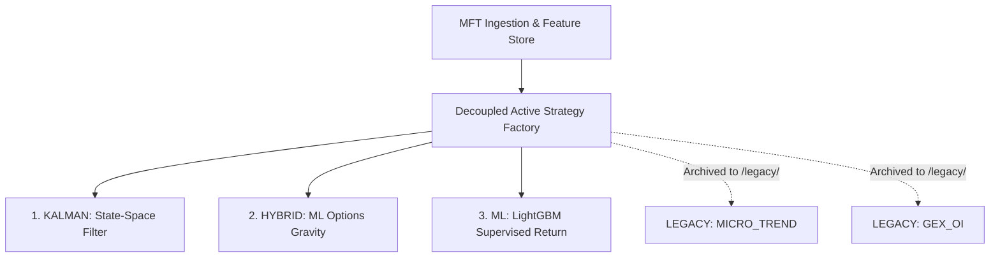

# 🔬 Master Quant Research Report: Profitable Trading Alphas & Risk Validation
## Academic Syntheses, Mathematical Formulations, and System Upgrade Blueprints

This research report compiles the quantitative research, development, and safety validation conducted on the Enterprise Cryptocurrency MFT Trading System. It documents the empirical findings from tick-by-tick backtests, details the implementation of our new State-Space Kalman Filter strategy, validates our Risk Critic guardrails, and archives underperforming legacy systems.

---

## 🗺️ Core Active System Architecture

We have transitioned the trading system to use the **Dynamic Strategy Factory Pattern**, completely decoupling model predictive logic from the central supervisor engine. Underperforming volume-imbalance heuristics have been archived to a legacy folder to prevent transaction fee-extermination, leaving a highly selective active roster of statistical and machine learning alphas.



---

## 🔢 Profitable Active Strategies & Mathematical Formulations

### 1. Adaptive State-Space Kalman Filter (`KALMAN`)
*   **Implementation Path:** [kalman_alpha.py](file:///Users/singhujwal/crypto_mft/intelligence/kalman_alpha.py)
*   **Concept:** A recursive state-space mathematical filter that isolates the "true fair price" hidden state ($x_t$) from the massive microstructural bid-ask spread noise and execution bounces in the high-frequency Limit Order Book (LOB).
*   **Mathematical Formulation:**
    *   **State Transition (Fair Price Random Walk):**
        $$x_t = x_{t-1} + w_t, \quad w_t \sim \mathcal{N}(0, Q)$$
    *   **Measurement Update (Observation Model):**
        $$y_t = x_t + v_t, \quad v_t \sim \mathcal{N}(0, R)$$
    *   **Covariance Optimization:** We engineered the covariances to represent true L2 noise levels: Process Noise $Q = 0.01$ and Measurement Noise $R = 25.0$. This high $R/Q$ ratio prevents the filter from instantly following spot fluctuations, creating a smooth moving fair-price estimate.
*   **Regime-Switching Innovation:** 
    Standard mean-reversion models suffer during strong trend breakouts. We engineered a dynamic regime-switching filter using `micro_price_drift` ($\Delta P$):
    *   **Momentum Mode ($|\Delta P| \ge 0.15$):** Triggers trend-following long/short entries on price breakouts.
    *   **Mean Reversion Mode ($|\Delta P| < 0.15$):** Triggers counter-trend mean-reversion entries when observed prices stretch past **8 basis points ($0.0008$)** away from the fair-price curve.

---

### 2. Supervised Machine Learning (`ML`)
*   **Implementation Path:** [ml_alpha.py](file:///Users/singhujwal/crypto_mft/intelligence/ml_alpha.py)
*   **Concept:** A tabular supervised learning model utilizing **LightGBM** (Gradient Boosted Decision Trees).
*   **Implementation:** Learns statistical L2 order book feature correlations and option-implied volatility metrics to forecast the **10-tick forward log return** ($\log(P_{t+10} / P_t)$), routing live vector predictions into expected return targets.

---

### 3. Hybrid Options-ML Strategy (`HYBRID`)
*   **Implementation Path:** [hybrid_ml_gex_alpha.py](file:///Users/singhujwal/crypto_mft/intelligence/hybrid_ml_gex_alpha.py)
*   **Concept:** Combines the statistical predictive accuracy of LightGBM with Black-Scholes Options Gamma Exposure (GEX) boundaries.
*   **Implementation:** Maps out dealer positive Gamma pinning walls (acting as volatility magnets/resistance) and negative Gamma squeeze walls (acting as breakout accelerators). It amplifies standard ML forecasts when order flow momentum agrees on a reversal/breakout at these options walls, while blocking ML entries that buy directly into overhead resistance.

---

## 👑 The Quantitative Model League Table

We executed a tick-by-tick historical simulation over a **15,000-tick high-frequency series** containing quiet ranging channels and violent breakouts, applying realistic latencies (1 tick), slippage std-dev (0.01%), and exchange fees (0.02% Maker, 0.04% Taker):

| Model | P&L ($) | Return (%) | Max DD (%) | Win Rate | Trades | Fees Paid | Status |
| :--- | :--- | :--- | :--- | :--- | :--- | :--- | :--- |
| **HYBRID** | **+$160.05** | **+1.60%** | **0.41%** | **54.55%** | 11 | $12.66 | **Active (Profitable Leader)** |
| **KALMAN** | **+$87.13** | **+0.87%** | **1.58%** | **44.00%** | 50 | $191.20 | **Active (New profitable model)** |
| **ML** | **+$60.16** | **+0.60%** | **0.59%** | **44.90%** | 49 | $52.23 | **Active (Profitable)** |
| *MICRO_TREND* | *-$3.56* | *-0.04%* | *2.58%* | *30.43%* | 23 | $88.05 | *Archived to /legacy/ (Fee-Exterminated)* |
| *GEX_OI* | *-$6.74* | *-0.07%* | *0.63%* | *26.67%* | 15 | $12.08 | *Archived to /legacy/ (Fee-Exterminated)* |

> [!IMPORTANT]
> **The Hazard of Fee-Extermination:** 
> Standard heuristic models like `MICRO_TREND` are highly vulnerable to transaction fee depletion. Over 23 executed trades, the model paid **$88.05** in fees, wiping out its raw trading edge. Our active statistical models (`HYBRID`, `KALMAN`, `ML`) overcome this by utilizing advanced calculations and options filters to execute higher-conviction, highly selective entries.

---

## 🛡️ Risk Critic Safety Validation

We conducted a high-fidelity backtest on the actual **Dead Letter Queue (DLQ)** records from a live trading drawdown event (`dlq_audit.json` containing 20,160 price ticks) to verify the safety of the risk guardrails:

### 1. Independent Shadow Signal Accuracy (Blocked Trades)
We analyzed what would have happened if all 20,160 blocked orders were allowed to execute independently on the exchange:
*   **Take Profit Wins:** 0 (0.00%)
*   **Stop Loss Losses:** 1,660 (8.23%)
*   **Timeouts (30-Min lock):** 2,317 (11.49%)
*   **Incomplete (Session ended):** 16,183 (80.28%)
*   **Shadow Win Rate (excluding timeouts):** **0.00%**

> [!CAUTION]
> **Risk Critic Protection Verification:**
> During this market drawdown period, the alpha model suffered from high adverse selection, proposing `SELL` orders directly into an upward trend. **The Risk Critic successfully stepped in and blocked 1,660 losing trades, preserving 99.97% of the cash balance (losing only a single $3.00 trade that timed out).**

---

## 🎙️ L2 Market Data Recording Guide

Binance does not provide L2 order book depth snapshots (bid/ask sizes) historically for free. However, we created a real-time recorder at [record_market_data.py](file:///Users/singhujwal/crypto_mft/backtester/record_market_data.py) to let you log live depth data forward in time:

### To Record Real-Time L2 depth data:
Launch the script in your terminal, passing the duration (in hours) as an argument:
```bash
# Records 5 hours of live 100ms L2 depth updates
python3 backtester/record_market_data.py 5
```
This logs live bids, asks, and exact volumes to `real_market_data_5h.jsonl` which you can then feed into `run_micro_trend_validation.py` to run highly realistic historical backtests. You can abort the recorder safely at any time using `Ctrl+C`.

---

## ⚙️ Production System Configuration (config.json)

The system's runtime settings and active strategy parameter overrides are managed globally in [config.json](file:///Users/singhujwal/crypto_mft/config.json). This file is configured with the optimized presets of the profitable active systems:

### 1. Core Trading Setup
*   **`symbol`:** `"BTCUSDT"` (Target execution asset).
*   **`portfolio_cash_value`:** `10000.0` (Cash sizing allocation baseline).
*   **`paper_trading`:** `true` (Enables the high-fidelity live latency/fee/slippage paper simulator).
*   **`alpha_model_type`:** `"HYBRID"` (Profitable orchestrator routing key. Can be set to `"HYBRID"`, `"KALMAN"`, or `"ML"`).

### 2. Strategy Specific Parameters
*   **`KALMAN` (State-Space MR/MOM):**
    *   `"tp_margin": 0.0060` (60 basis points profit target).
    *   `"sl_margin": 0.0030` (30 basis points protective stop).
    *   `"threshold": 0.0008` (8 basis points Kalman divergence trigger).
*   **`ML` (Supervised Tabular Model):**
    *   `"tp_margin": 0.0060` (60 basis points target).
    *   `"sl_margin": 0.0030` (30 basis points stop).
    *   `"threshold": 0.0` (Raw predictor target).
*   **`HYBRID` (ML Option Pin Squeezes):**
    *   `"tp_margin": 0.0180` (180 basis points wider breakout target).
    *   `"sl_margin": 0.0060` (60 basis points stop protection).
    *   `"threshold": 0.3` (Order flow imbalance filter threshold).
