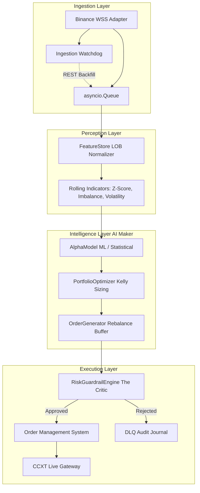

# Enterprise Cryptocurrency Medium-Frequency Trading (MFT) System

This repository contains a highly modular, production-grade Medium-Frequency Trading (MFT) system engineered for cryptocurrency markets (Binance). The architecture is built around **Zero-Tolerance Fault Isolation**, strictly separating ingestion from mathematics, intelligence from execution, and enforcing Maker-Critic risk guardrails.

---

## 🏗️ Architectural Overview



---

## 📂 Directory Structure

```text
mft_project/
├── core/
│   ├── schemas.py           # Unified contracts (InternalTick, Binance payloads)
│   └── exceptions.py        # Domain exception hierarchy (DataStall, RateLimit)
├── ingestion/
│   ├── base_adapter.py      # Abstract interface contract (DataFeedAdapter)
│   ├── watchdog.py          # Health monitoring & REST reconciliation
│   └── binance_adapter.py   # Binance Crypto WSS adapter
├── perception/
│   └── feature_store.py     # Rolling deques & mathematical indicators
├── intelligence/
│   └── alpha_engine.py      # Alpha predictions, Kelly sizing, & Order Generation
├── execution/
│   └── risk_critic.py       # The Critic & OMS State Machine
├── dlq_audit.json           # Dead Letter Queue audit log for rejected orders
├── requirements.txt         # Dependency requirements
└── main.py                  # Asyncio orchestration entry point
```

---

## 🚀 Installation & Setup

1. **Create a Python Virtual Environment:**
   ```powershell
   python -m venv venv
   .\venv\Scripts\Activate.ps1
   ```

2. **Install Dependencies:**
   ```bash
   pip install -r requirements.txt
   ```

---

## ⚙️ Configuration & Environment Variables

The system uses environment variables to control execution modes and safety limits.

| Variable | Description | Default |
| :--- | :--- | :--- |
| `BINANCE_API_KEY` | Your live Binance API Key (Required for live trading) | `None` |
| `BINANCE_API_SECRET` | Your live Binance API Secret (Required for live trading) | `None` |
| `PORTFOLIO_CASH_VALUE` | Starting bankroll in USD | `10000.0` |
| `PAPER_TRADING` | `true` for simulation, `false` for live money execution | `true` |

---

## 🎮 How to Run in Paper Trading Mode (Simulation)

Paper Trading mode connects to live Binance WebSockets, computes real indicators, and evaluates Alpha models, but **simulates order execution** without risking real capital.

```powershell
$env:PAPER_TRADING="true"
$env:PORTFOLIO_CASH_VALUE="10000.0"

python main.py
```

### What to Expect:
- The bot will subscribe to `BTCUSDT` Level 2 depth.
- You will see `Phase 2 [Perception]` feature vectors printed every second.
- You will see `Phase 3 [Intelligence]` forecasts and proposed orders.
- The OMS will simulate fills and update the local inventory state.

---

## ⚠️ How to Run in Live Production Mode (Real Trading)

Live Production mode initializes a real `ccxt.pro` client. **It will execute real limit orders on Binance using your actual account balance.**

```powershell
$env:BINANCE_API_KEY="<your_api_key>"
$env:BINANCE_API_SECRET="<your_api_secret>"
$env:PORTFOLIO_CASH_VALUE="<your_portfolio_cash_value>"
$env:PAPER_TRADING="<true/false>"

python main.py
```

### Safety Guardrail Note:
If `PAPER_TRADING="false"` and your API credentials are missing, the supervisor will halt startup immediately with a critical error to prevent silent execution failures.

---

## ✔️ How to Run Tests

We use `pytest` and `pytest-asyncio` to verify subsystem integrity.

```bash
pytest
```

*(Note: To add unit tests, create a `tests/` directory and import the core classes).*

---

## 🛡️ Fault Isolation & Recovery Mechanics

1. **WebSocket Disconnection:** If your cloud instance experiences network jitter, the `IngestionWatchdog` automatically reconnects and queries Binance's REST depth endpoint (`aiohttp`) to backfill missing ticks.
2. **Schema Validation:** Built with `Pydantic`. Malformed exchange JSON frames are caught and logged without crashing the async event loop.
3. **Dead Letter Queue (DLQ):** Any order that breaches Daily Max Drawdown ($5\%$) or Price Collars ($\pm 2\%$ of mid) is blocked by the Risk Critic and appended to `dlq_audit.json` for auditability.
