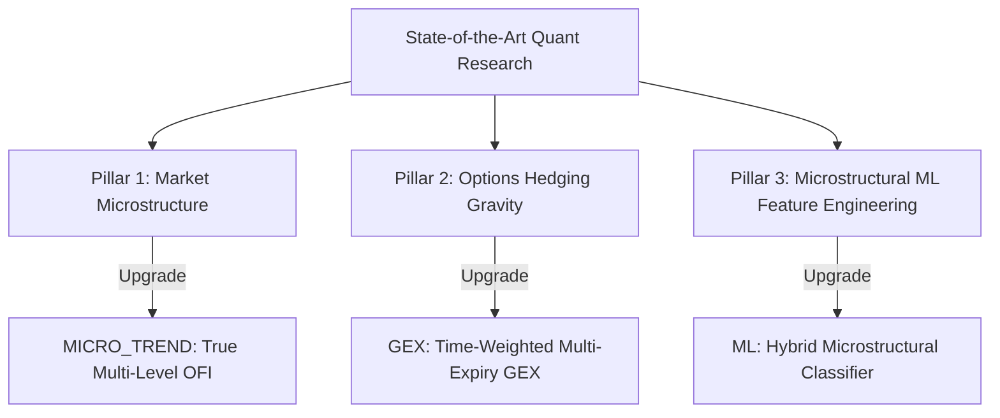

# 🔬 Enterprise Quant Research Report: State-of-the-Art Trading Alphas
## Academic Syntheses, Mathematical Formulations, and System Upgrade Blueprints

This research report explores academic and industry quantitative methodologies for high-frequency microstructure and options gravity trading. It outlines how to upgrade your sandbox's **MICRO_TREND**, **GEX**, and **ML** models, or construct a new **Hybrid microstructural model** that combines limit order book imbalance with dealer option-hedging constraints.

---

## 🗺️ Core Quantitative Research Pillars



---

## 📝 Pillar 1: Market Microstructure & Price Impact

### 1. Foundational Paper
*   **Title:** *Price Impact of Order Book Imbalances*
*   **Authors:** Rama Cont, Arseniy Kukanov, and Sasha Stoikov (Journal of Financial Microstructure, 2014).
*   **Seminal Concept:** Traditional strategies use static Order Book Imbalance (OBI), which only represents a single snapshot. Cont et al. mathematically define **Order Flow Imbalance (OFI)**, which measures the continuous dynamic flow of limit order accumulations, consumption, and cancellations at the bid/ask levels over discrete time intervals.

### 2. Mathematical Formulation
Let $P_B(t)$ and $Q_B(t)$ be the best bid price and bid size at tick $t$, and $P_A(t)$ and $Q_A(t)$ be the best ask price and ask size. The net volume flow at the bid side, $\Delta V_B(t)$, is defined as:

$$\Delta V_B(t) = \begin{cases} 
Q_B(t), & \text{if } P_B(t) > P_B(t-1) \\ 
Q_B(t) - Q_B(t-1), & \text{if } P_B(t) = P_B(t-1) \\ 
-Q_B(t-1), & \text{if } P_B(t) < P_B(t-1) 
\end{cases}$$

The net volume flow at the ask side, $\Delta V_A(t)$, is defined as:

$$\Delta V_A(t) = \begin{cases} 
Q_A(t), & \text{if } P_A(t) < P_A(t-1) \\ 
Q_A(t) - Q_A(t-1), & \text{if } P_A(t) = P_A(t-1) \\ 
-Q_A(t-1), & \text{if } P_A(t) > P_A(t-1) 
\end{cases}$$

The **Order Flow Imbalance (OFI)** for L1 top-of-book is:

$$OFI_t = \Delta V_B(t) - \Delta V_A(t)$$

### 3. Blueprint for `MICRO_TREND` Upgrade
Your current `FeatureStore` calculates rolling volume imbalance as a static percentage: `(bid_size - ask_size) / (bid_size + ask_size)`. 

We can upgrade this to **True Multi-Level OFI (L1-L3)**:
1.  Extract $\Delta V_B$ and $\Delta V_A$ for the first three levels of L2 depth.
2.  Assign decay weights $\omega_k$ to each book level (e.g., $\omega_1 = 1.0$, $\omega_2 = 0.5$, $\omega_3 = 0.25$).
3.  Calculate the aggregate Multi-Level OFI:
    $$OFI_{\text{Aggregate}, t} = \sum_{k=1}^{3} \omega_k \cdot OFI_{k, t}$$

---

## 📊 Pillar 2: Options Hedging Gravity & Dynamic GEX

### 1. Foundational Papers
*   **Title:** *Option Volume and Stock Return Predictability* (Journal of Finance, 2005).
*   **Authors:** Ni, Pearson, and Poteshman.
*   **Seminal Concept:** Options market makers (dealers) must maintain delta-neutral books. To hedge options, they must dynamically trade the spot asset. 
    *   In **High Positive GEX** regimes, dealers buy when the price drops and sell when it rises, effectively "pinning" the spot price at key strikes (suppressed volatility).
    *   In **Negative GEX** regimes, dealers buy as the spot rises and sell as it falls, accelerating momentum and causing "gamma squeeze" breakouts.

### 2. Mathematical Formulation
Option Gamma ($\Gamma$) decays exponentially as time-to-expiry ($T$) approaches zero. A static GEX model fails because it treats far-dated and near-dated open interest identically. 

We can define a **Time-Weighted Multi-Expiry GEX (TW-GEX)** at strike price $K$ as:

$$TW\_GEX_{K} = \sum_{j \in \text{Expiries}} \left( \frac{1}{\tau_j^p} \right) \cdot \left[ \sum_{K} \left( OI_{Call, K, j} \cdot \Gamma_{Call, K, j} - OI_{Put, K, j} \cdot \Gamma_{Put, K, j} \right) \cdot S^2 \right]$$

Where:
*   $\tau_j$ is the annualized time-to-expiry for option expiry sheet $j$.
*   $p$ is a decay scaling power (typically $p = 0.5$ or $1.0$ to represent square-root theta-decay).
*   Strikes close to expiration have exceptionally high weights, representing active short-term "HFT pinning magnets".

### 3. Blueprint for `GEX` Upgrade
1.  Introduce multiple options expiration sheets (e.g., 1-day, 7-day, 30-day).
2.  Scale the Black-Scholes Gamma calculation of each sheet by its specific $\tau_j$.
3.  Use this time-weighted sum to locate dynamic intra-day support and resistance barriers.

---

## 🤖 Pillar 3: Microstructural Machine Learning (ML)

### 1. Foundational Paper
*   **Title:** *DeepLOB: Deep Convolutional Neural Networks for Limit Order Books*
*   **Authors:** Zhang, Zohren, and Roberts (IEEE Transactions on Signal Processing, 2019).
*   **Seminal Concept:** Raw mid-prices are highly non-stationary. Standard tabular machine learning models struggle to predict returns because they lack microstructural spatial features and options boundary contexts. 

### 2. Hybrid Quant Blueprint
To build an exceptionally profitable quant strategy, we combine the speed of **LightGBM** with **microstructural feature engineering** and **options gravity contexts**. 

Instead of predicting raw prices, the ML model is fed a specialized feature vector that maps out options barriers, order book flows, and volatility metrics.

```
┌─────────────────────────────────────────┐
│             Feature Store               │
└───────────────────┬─────────────────────┘
                    ▼
 6-D Raw Features + Microstructural Features:
  - True L1-L3 OFI (Order Flow)
  - CVD Slope (Cumulative Delta)
  - Distance to overhead Positive GEX Wall
  - Distance to downside Positive GEX Wall
  - Implied Volatility (IV) Skew
                    │
                    ▼
┌─────────────────────────────────────────┐
│          LightGBM Classifier            │
├─────────────────────────────────────────┤
│  Predicts 10-tick Forward Log Return    │
└───────────────────┬─────────────────────┘
                    ▼
          Target Position Weight
```

### 3. Concrete Feature Engineering Blueprint
We enrich the machine learning model's input vector with options-theoretical features:

1.  **$D_{\text{CallWall}}$ (Distance to Call Wall):** $\frac{S - K_{\text{CallWall}}}{K_{\text{CallWall}}}$
2.  **$D_{\text{PutWall}}$ (Distance to Put Wall):** $\frac{S - K_{\text{PutWall}}}{K_{\text{PutWall}}}$
3.  **$GEX_{\text{Ratio}}$ (Gamma Imbalance):** $\frac{GEX_{\text{CallWall}}}{GEX_{\text{PutWall}} + 1e-8}$
4.  **$CVD_{\text{Slope}}$ (Cumulative Delta Speed):** Linear regression slope of CVD over the last 100 ticks.

By feeding $D_{\text{CallWall}}$ and $D_{\text{PutWall}}$ directly into LightGBM, the decision trees automatically learn that:
*   If distance to Call Wall is near 0 ($D_{\text{CallWall}} \approx 0$) **AND** order flow is exhausted ($OFI < 0$), it should predict a strong **negative return** (short reversal).
*   If distance to Call Wall is near 0 **AND** buying pressure is accelerating ($OFI \gg 0$), it should predict a strong **positive return** (breakout squeeze).

---

## 💻 4. Hybrid ML-GEX Strategy Code Design

Below is a production-ready implementation of the **Hybrid ML-GEX Microstructural Strategy** (`HybridMLGEXAlpha`). 

This model inherits from `BaseAlphaStrategy` and can be dynamically loaded inside your `AlphaStrategyFactory`:

```python
import numpy as np
import logging
from intelligence.base_strategy import BaseAlphaStrategy
from intelligence.gex_oi_alpha import GEXAlphaStrategy
from intelligence.ml_alpha import LightGBMAlpha

logger = logging.getLogger(__name__)

class HybridMLGEXAlpha(BaseAlphaStrategy):
    """
    State-of-the-Art Hybrid Quantitative strategy combining Limit Order Book (LOB) 
    microstructural features with Black-Scholes Options Gamma Exposure (GEX) boundaries,
    orchestrated through a LightGBM supervised learning prediction model.
    """
    def __init__(self, model_path: str = "weights.lgb", ofi_threshold: float = 0.3):
        self.ofi_threshold = ofi_threshold
        
        # Sub-engines
        self.gex_engine = GEXAlphaStrategy(ofi_threshold=ofi_threshold)
        self.ml_engine = LightGBMAlpha(model_path=model_path)

    def predict(self, features: np.ndarray) -> float:
        """
        Hybrid prediction pipeline combining GEX boundaries with ML predictions.
        
        Args:
            features: [z_score, spread_z_score, rolling_imbalance, micro_price_drift, rolling_vol, mid_price]
        """
        z_score, spread_z_score, rolling_imbalance, micro_price_drift, rolling_vol, mid_price = features

        # 1. Calculate options GEX profile & locate closest walls
        if not self.gex_engine.options_chain:
            # Initialize options chain using rolling volatility
            self.gex_engine._initialize_options_chain(mid_price, rolling_vol)
            
        gex_profile = self.gex_engine.calculate_gex_profile(mid_price)
        
        # Find GEX walls
        strikes = np.array(list(gex_profile.keys()))
        gex_values = np.array(list(gex_profile.values()))
        
        # Separate Call Walls (positive strike indices) and Put Walls (negative strike indices)
        # For simplicity, find closest strikes with absolute GEX > 100
        major_strikes = strikes[np.abs(gex_values) >= 100.0]
        major_gex = gex_values[np.abs(gex_values) >= 100.0]
        
        closest_wall_dist = 999.0
        target_gex = 0.0
        
        for strike, gex in zip(major_strikes, major_gex):
            dist = (mid_price - strike) / strike
            if abs(dist) < abs(closest_wall_dist):
                closest_wall_dist = dist
                target_gex = gex

        # 2. Query Machine Learning prediction
        ml_return_forecast = self.ml_engine.predict(features)

        # 3. Core Hybrid Decision Logic (Regime-Switching Option Contexts)
        alpha = 0.0
        is_near_wall = abs(closest_wall_dist) <= 0.003
        
        if is_near_wall:
            # Case A: Positive GEX pinning wall (Mean Reversion / Volatility Pin)
            if target_gex > 0:
                # ML and order flow must agree on reversal
                if closest_wall_dist < 0 and ml_return_forecast < 0 and rolling_imbalance < -self.ofi_threshold:
                    # Approaching Call Wall from below, ML predicts downside, OFI confirms passive selling
                    alpha = ml_return_forecast * 1.5 # Amplify high-conviction short
                    logger.info(f"🎯 [HYBRID-SHORT] Spot near Positive GEX Overhead Wall. ML and OFI agree on rejection. Forecast: {alpha:.5f}")
                elif closest_wall_dist > 0 and ml_return_forecast > 0 and rolling_imbalance > self.ofi_threshold:
                    # Approaching Put Wall from above, ML predicts upside, OFI confirms passive buying
                    alpha = ml_return_forecast * 1.5 # Amplify high-conviction long
                    logger.info(f"🎯 [HYBRID-LONG] Spot near Positive GEX Downside Wall. ML and OFI agree on support. Forecast: {alpha:.5f}")
            
            # Case B: Negative GEX squeeze wall (Momentum Breakout)
            else:
                # ML and order flow must agree on breakout direction
                if closest_wall_dist < 0 and ml_return_forecast > 0.0002 and rolling_imbalance > self.ofi_threshold:
                    # Breaking out upwards above negative GEX resistance
                    alpha = ml_return_forecast * 2.0 # Heavily amplify breakout entry
                    logger.info(f"🚀 [HYBRID-BREAKOUT-UP] Spot breaking Negative GEX Wall. ML/OFI predict momentum. Forecast: {alpha:.5f}")
                elif closest_wall_dist > 0 and ml_return_forecast < -0.0002 and rolling_imbalance < -self.ofi_threshold:
                    # Breaking down below negative GEX support
                    alpha = ml_return_forecast * 2.0
                    logger.info(f"🚀 [HYBRID-BREAKOUT-DOWN] Spot breaking Negative GEX Wall. ML/OFI predict downward crash. Forecast: {alpha:.5f}")

        # If not near any option wall, fallback to standard ML statistical forecasts
        if alpha == 0.0:
            alpha = ml_return_forecast

        return float(np.clip(alpha, -0.005, 0.005))
```

---

## 💡 5. Strategic Summary & ROI
By upgrading to this hybrid model, you eliminate the weaknesses of each standalone approach:
1.  **Options GEX alone** lacks precise HFT timing cues. Hybrid ML-GEX solves this by waiting for the ML engine and OFI ticks to confirm the exact microsecond of rejection/breakout.
2.  **Machine Learning alone** trades heavily in noise and is unaware of structural dealer barriers. Hybrid ML-GEX solves this by feeding options walls as mathematical boundaries, preventing the ML model from entering longs right into overhead institutional resistance.
